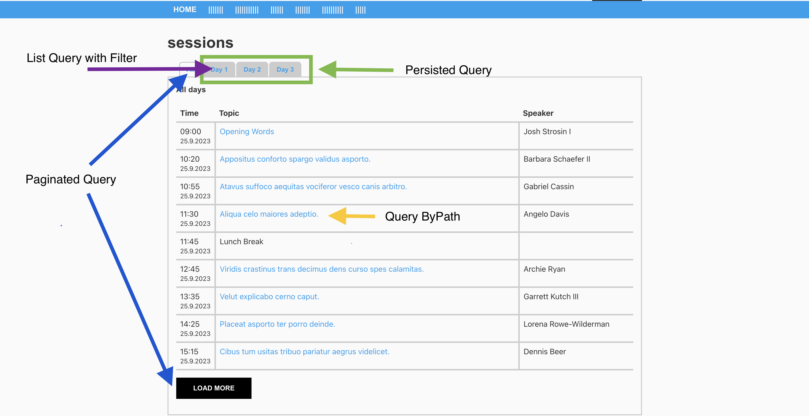

# aem-headless-demo

## AEM

1. Install [adaptto-aem-headless.zip](adaptto-package%2Fadaptto-aem-headless.zip) package
2. Package contains
    - CF content
    - GraphQL config: model, endpoint and Persistent Query
    - OsgiConfig: CORS and CSRF
   
## APP:

1. Change PORT to fit AEM instance: /src/api/config.js
2. Install dependencies: `npm i`
3. Build app: `npm run build`
4. Start server: `npm run serve`

5. Default port is http://localhost:8080/ if available, if not check logs from last command for correct url.

## DEMO

- Persistent Query
- List Query with filters
- Query ByPath
- Paginated Query with Load More

